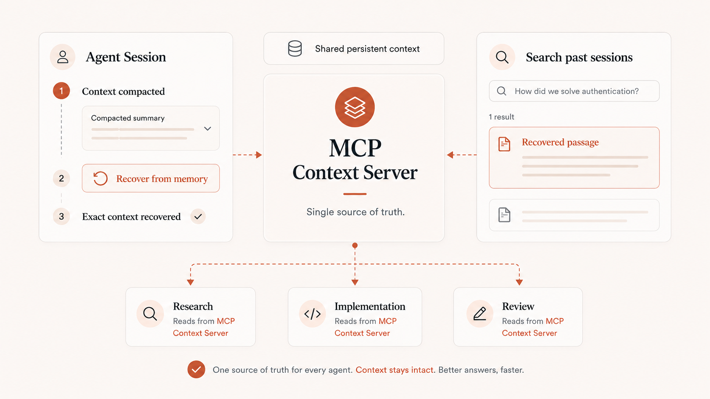

# Servidor de Contexto MCP

  

   

Un servidor de alto rendimiento del Protocolo de Contexto de Modelo (MCP) que proporciona almacenamiento de contexto multimodal persistente para agentes de LLM. Construido con FastMCP, este servidor permite compartir contexto sin problemas entre múltiples agentes que trabajan en la misma tarea mediante un alcance basado en hilos (threads).

> [!WARNING]
> **¿Actualizando desde v2.x?** La versión 3.x.x utiliza un nuevo esquema de base de datos con claves primarias UUIDv7. Las bases de datos v2.x existentes requieren una migración de datos única antes de poder usarlas con v3.x.x. La CLI opt-in `mcp-context-server-migrate` se incluye con el servidor.
>
> **Consulte la [Guía de migración](docs/migration-v2-to-v3.md) antes de actualizar.** Las instalaciones nuevas no se ven afectadas.

## Características principales

- **Almacenamiento de contexto multimodal**: Almacena y recupera tanto texto como imágenes
- **Identificadores de contexto UUIDv7**: Cada entrada de contexto se identifica mediante un valor hex UUIDv7 de 32 caracteres en minúsculas, que proporciona ID únicos a nivel global y ordenados cronológicamente, con un ordenamiento lexicográfico de cadenas estable
- **Alcance basado en hilos (threads)**: Los agentes que trabajan en la misma tarea comparten contexto a través de ID de hilo
- **Filtrado flexible de metadatos**: Almacena datos estructurados personalizados con cualquier campo serializable en JSON y filtra utilizando 16 operadores potentes
- **Filtrado por rango de fechas**: Filtra las entradas de contexto por marca de tiempo de creación utilizando el formato ISO 8601
- **Organización basada en etiquetas**: Recuperación eficiente del contexto con etiquetas normalizadas e indexadas
- **Generación de resúmenes**: Resumen automático opcional basado en LLM que se devuelve junto con `text_content` truncado en todos los resultados de las herramientas de búsqueda para mejorar la eficiencia del contexto del agente (habilitado de forma predeterminada con Ollama)
- **Búsqueda de texto completo**: Búsqueda lingüística con reducción a raíz (stemming), clasificación, consultas booleanas (FTS5/tsvector) y reclasificación con codificador cruzado (cross-encoder). Se habilita automáticamente de forma predeterminada (`ENABLE_FTS=auto`); no requiere dependencias adicionales
- **Búsqueda semántica**: Búsqueda por similitud de vectores para recuperación basada en significado con reclasificación con codificador cruzado. Se habilita automáticamente de forma predeterminada (`ENABLE_SEMANTIC_SEARCH=auto`) siempre que haya un proveedor de embeddings disponible (la generación de embeddings está activada por defecto)
- **Búsqueda híbrida**: Búsqueda combinada de FTS + semántica utilizando Reciprocal Rank Fusion (RRF) con reclasificación con codificador cruzado. Se habilita automáticamente de forma predeterminada (`ENABLE_HYBRID_SEARCH=auto`) siempre que esté disponible al menos una de las búsquedas de texto completo o semántica
- **Grep en el servidor**: Coincidencia de patrones literal/regex, orientada a líneas y sin clasificación sobre registros almacenados (`grep_context`) — el complemento de localización precisa para la búsqueda de texto completo/semántica, con modos de salida estilo ripgrep y resultados limitados. Se habilita automáticamente de forma predeterminada (`ENABLE_GREP_CONTEXT=auto`), es Python puro por lo que se comporta idénticamente en SQLite y PostgreSQL
- **Navegación de registros (index_tree)**: `navigate_context` genera un índice de contenidos con encabezados Markdown bajo demanda por registro, con el resumen de la entrada como nodo raíz; los resúmenes opcionales por nodo con LLM (activados por defecto) enriquecen cada sección. Combínalo con `read_context_range` para extraer cualquier sección
- **Lecturas parciales**: `read_context_range` devuelve una porción de un registro por rango de caracteres, rango de líneas o `node_id` del esquema — así un agente puede leer solo el fragmento relevante de un registro largo en lugar de todo el registro
- **Reclasificación con codificador cruzado (Cross-Encoder)**: Refinamiento automático de resultados utilizando modelos cross-encoder de FlashRank para mejorar la precisión de búsqueda (habilitado de forma predeterminada)
- **Compresión de embeddings (activado por defecto)**: Reduce el almacenamiento de embeddings aproximadamente 8x de serie en v3.0.0. Los vectores comprimidos con empaquetado de bits mantienen la búsqueda semántica e híbrida funcionando sin cambios en la interfaz de las herramientas, y la ruta de lectura omite el límite de HNSW de >2000 dimensiones de pgvector. Establezca `ENABLE_EMBEDDING_COMPRESSION=false` para optar por no participar y mantener el almacenamiento fp32. Consulte la [Guía de compresión de embeddings](docs/embedding-compression.md)
- **Múltiples backends de base de datos**: Elija entre SQLite (predeterminado, configuración cero) o PostgreSQL (alta concurrencia, nivel de producción)
- **Alto rendimiento**: Modo WAL (SQLite) / MVCC (PostgreSQL), indexación estratégica y operaciones asíncronas
- **Cumplimiento del estándar MCP**: Funciona con Claude Code, LangGraph y cualquier cliente compatible con MCP
- **Listo para producción**: Cobertura completa de pruebas, seguridad de tipos y manejo robusto de errores

## Conexión con su asistente de IA

La forma más rápida de conectar el Servidor de Contexto MCP a Claude Code es mediante el arranque con un solo comando de Docker.

Para instrucciones paso a paso, requisitos previos, solución de problemas y comandos de actualización/desinstalación, consulte la [Guía de conexión con su asistente de IA](docs/connecting-ai-assistant.md).

## Configuración del entorno

El servidor se configura completamente mediante variables de entorno, que soportan configuraciones principales, transporte, autenticación, proveedores de embeddings, generación de resúmenes, características de búsqueda, ajuste de base de datos y más. Las variables se pueden establecer en la configuración de su cliente MCP, en un archivo `.env` o directamente en la terminal.

Para la referencia completa de todas las variables de entorno con tipos, valores predeterminados, restricciones y descripciones, consulte la [Referencia de variables de entorno](docs/environment-variables.md).

## Generación de resúmenes

La generación de resúmenes crea automáticamente resúmenes concisos basados en LLM para cada entrada de contexto almacenada. Los resúmenes se devuelven en el campo `summary` de todos los resultados de las herramientas de búsqueda junto con `text_content` truncado, proporcionando resúmenes densos e informativos que ayudan a los agentes a determinar la relevancia sin obtener las entradas completas.

Para instrucciones detalladas que incluyen todos los proveedores (Ollama, OpenAI, Anthropic), selección de modelos y configuración de prompts personalizados, consulte la [Guía de generación de resúmenes](docs/summary-generation.md).

## Búsqueda semántica

La búsqueda semántica se habilita automáticamente de forma predeterminada (`ENABLE_SEMANTIC_SEARCH=auto`): la herramienta `semantic_search_context` se registra automáticamente siempre que haya un proveedor de embeddings disponible (la generación de embeddings está activada por defecto), y se omite silenciosamente en caso contrario. Para instrucciones detalladas sobre los múltiples proveedores de embeddings (Ollama, OpenAI, Azure, HuggingFace, Voyage) y cómo controlar el interruptor explícitamente, consulte la [Guía de búsqueda semántica](docs/semantic-search.md).

## Búsqueda de texto completo

La búsqueda de texto completo se habilita automáticamente de forma predeterminada (`ENABLE_FTS=auto`) y no necesita dependencias adicionales, utiliza el motor FTS integrado de la base de datos (FTS5 en SQLite, tsvector en PostgreSQL). Para el procesamiento lingüístico, reducción a raíz (stemming), clasificación y consultas booleanas, consulte la [Guía de búsqueda de texto completo](docs/full-text-search.md).

## Búsqueda híbrida

La búsqueda híbrida se habilita automáticamente de forma predeterminada (`ENABLE_HYBRID_SEARCH=auto`): la herramienta `hybrid_search_context` se registra automáticamente siempre que esté disponible al menos una de las búsquedas de texto completo o semántica. Para la búsqueda combinada de FTS + semántica utilizando Reciprocal Rank Fusion (RRF), consulte la [Guía de búsqueda híbrida](docs/hybrid-search.md).

## Filtrado de metadatos

Para un filtrado integral de metadatos que incluye 16 operadores, rutas JSON anidadas y optimización de rendimiento, consulte la [Guía de metadatos](docs/metadata-addition-updating-and-filtering.md).

## Backends de base de datos

El servidor admite múltiples backends de base de datos, seleccionables mediante la variable de entorno `STORAGE_BACKEND`. SQLite (predeterminado) proporciona almacenamiento local sin configuración, perfecto para implementaciones de un solo usuario. PostgreSQL ofrece capacidades de alto rendimiento con un throughput de escritura 10x+ para implementaciones multusuario y de alto tráfico.

Para instrucciones detalladas de configuración, incluida la instalación de PostgreSQL con Docker, integración con Supabase, métodos de conexión y solución de problemas, consulte la [Guía de backends de base de datos](docs/database-backends.md).

## Referencia de la API

El Servidor de Contexto MCP expone 16 herramientas MCP para la gestión de contexto:

**Operaciones principales:** `store_context`, `search_context`, `get_context_by_ids`, `delete_context`, `update_context`, `list_threads`, `get_statistics`

**Herramientas de búsqueda:** `semantic_search_context`, `fts_search_context`, `hybrid_search_context`

**Herramientas de navegación (localizar / navegar / extraer):** `grep_context`, `navigate_context`, `read_context_range`

**Operaciones en lotes:** `store_context_batch`, `update_context_batch`, `delete_context_batch`

Para la documentación completa de las herramientas, incluidos parámetros, valores de retorno, opciones de filtrado y ejemplos, consulte la [Referencia de la API](docs/api-reference.md). Para saber cuándo usar grep frente a texto completo frente a búsqueda semántica, el index_tree y las lecturas parciales, consulte [Grep, Navegación y Lecturas Parciales](docs/grep-navigation-partial-read.md).

## Implementación con Docker

Para implementaciones de producción con transporte HTTP y orquestación de contenedores, se encuentran disponibles configuraciones de Docker Compose para SQLite, PostgreSQL y PostgreSQL externo (Supabase). Consulte la [Guía de implementación con Docker](docs/deployment/docker.md) para instrucciones de configuración y detalles de conexión del cliente.

## Implementación en Kubernetes

Para implementaciones en Kubernetes, se proporciona un chart de Helm con valores configurables para diferentes entornos. Consulte la [Guía de implementación con Helm](docs/deployment/helm.md) para instrucciones de instalación, o la [Guía de implementación en Kubernetes](docs/deployment/kubernetes.md) para conceptos generales de Kubernetes.

## Autenticación

Para implementaciones con transporte HTTP que requieren autenticación, consulte la [Guía de autenticación](docs/authentication.md) para la configuración de tokens bearer.

## Obtener ayuda

- **Reportes de errores**: [Reportar un error](https://github.com/alex-feel/mcp-context-server/issues/new?template=bug-report.yml)
- **Solicitudes de características**: [Sugerir una característica](https://github.com/alex-feel/mcp-context-server/issues/new?template=feature-request.yml)
- **Problemas de documentación**: [Reportar un problema de documentación](https://github.com/alex-feel/mcp-context-server/issues/new?template=docs-issue.yml)
- **Preguntas**: [Hacer una pregunta](https://github.com/alex-feel/mcp-context-server/issues/new?template=question.yml)

## Licencia

El Servidor de Contexto MCP está licenciado bajo la [Licencia Elastic 2.0](LICENSE) (ELv2).

En resumen: puede usar, copiar, modificar, distribuir y ejecutar el software libremente y sin costo alguno — para proyectos personales, dentro de empresas de cualquier tamaño y como parte de trabajo comercial. La única cosa que no puede hacer sin un acuerdo comercial es proporcionar el software a terceros como un servicio alojado o gestionado que brinde a los usuarios acceso a cualquier conjunto sustancial de sus características o funcionalidades (por ejemplo, una oferta en la nube de "memoria para agentes" construida sobre él).

Consulte [Licenciamiento comercial](docs/commercial-licensing.md) para ejemplos en lenguaje sencillo de lo que está y no está permitido, y contacte a [alexfeel@protonmail.com](mailto:alexfeel@protonmail.com) para licencias comerciales, incluidos los derechos de servicio alojado o gestionado.

Las versiones hasta e incluyendo la v2.2.2 se publicaron bajo la Licencia MIT y permanecen disponibles bajo ella; la Licencia Elastic 2.0 se aplica desde la v3.0.0 en adelante.

<!-- mcp-name: io.github.alex-feel/mcp-context-server -->
