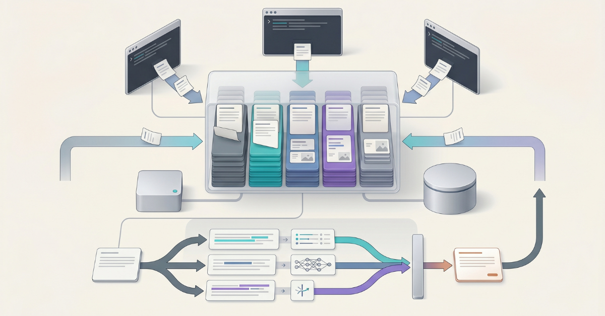

# MCP Context Server

<p align="center">
  
</p>

[](https://pypi.org/project/mcp-context-server/) [](https://registry.modelcontextprotocol.io/?q=io.github.alex-feel%2Fmcp-context-server) [](https://github.com/alex-feel/mcp-context-server/blob/main/LICENSE) [](https://deepwiki.com/alex-feel/mcp-context-server)

A high-performance Model Context Protocol (MCP) server providing persistent multimodal context storage for LLM agents. Built with FastMCP, this server enables seamless context sharing across multiple agents working on the same task through thread-based scoping.

## Key Features

- **Multimodal Context Storage**: Store and retrieve both text and images
- **Thread-Based Scoping**: Agents working on the same task share context through thread IDs
- **Flexible Metadata Filtering**: Store custom structured data with any JSON-serializable fields and filter using 16 powerful operators
- **Date Range Filtering**: Filter context entries by creation timestamp using ISO 8601 format
- **Tag-Based Organization**: Efficient context retrieval with normalized, indexed tags
- **Summary Generation**: Optional automatic LLM-based summarization returned alongside truncated `text_content` in all search tool results for better agent context efficiency (enabled by default with Ollama)
- **Full-Text Search**: Optional linguistic search with stemming, ranking, boolean queries (FTS5/tsvector), and cross-encoder reranking
- **Semantic Search**: Optional vector similarity search for meaning-based retrieval with cross-encoder reranking
- **Hybrid Search**: Optional combined FTS + semantic search using Reciprocal Rank Fusion (RRF) with cross-encoder reranking
- **Cross-Encoder Reranking**: Automatic result refinement using FlashRank cross-encoder models for improved search precision (enabled by default)
- **Multiple Database Backends**: Choose between SQLite (default, zero-config) or PostgreSQL (high-concurrency, production-grade)
- **High Performance**: WAL mode (SQLite) / MVCC (PostgreSQL), strategic indexing, and async operations
- **MCP Standard Compliance**: Works with Claude Code, LangGraph, and any MCP-compatible client
- **Production Ready**: Comprehensive test coverage, type safety, and robust error handling

## Prerequisites

- `uv` package manager ([install instructions](https://docs.astral.sh/uv/getting-started/installation/))
- An MCP-compatible client (Claude Code, LangGraph, or any MCP client)
- Ollama (for embedding and summary generation - default behavior):
  - Install from [ollama.com/download](https://ollama.com/download)
  - Pull embedding model: `ollama pull qwen3-embedding:0.6b`
  - Pull summary model: `ollama pull qwen3:0.6b`

## Adding the Server to Claude Code

There are two ways to add the MCP Context Server to Claude Code:

### Method 1: Using CLI Command

```bash
# Default setup (recommended) - embeddings + summary + reranking
# Requires: Ollama installed + models pulled (see Prerequisites)
claude mcp add context-server -- uvx --python 3.12 --with "mcp-context-server[embeddings-ollama,summary-ollama,reranking]" mcp-context-server

# From GitHub (latest development version)
claude mcp add context-server -- uvx --python 3.12 --from git+https://github.com/alex-feel/mcp-context-server --with "mcp-context-server[embeddings-ollama,summary-ollama,reranking]" mcp-context-server
```

For more details, see: <https://docs.claude.com/en/docs/claude-code/mcp#option-1%3A-add-a-local-stdio-server>

### Method 2: Direct File Configuration

Add the following to your `.mcp.json` file in your project directory:

```json
{
  "mcpServers": {
    "context-server": {
      "type": "stdio",
      "command": "uvx",
      "args": ["--python", "3.12", "--with", "mcp-context-server[embeddings-ollama,summary-ollama,reranking]", "mcp-context-server"],
      "env": {}
    }
  }
}
```

**Prerequisites:** Ollama must be installed with the required models pulled: `ollama pull qwen3-embedding:0.6b` and `ollama pull qwen3:0.6b`.

For the latest development version from GitHub, use:
```json
"args": ["--python", "3.12", "--from", "git+https://github.com/alex-feel/mcp-context-server", "--with", "mcp-context-server[embeddings-ollama,summary-ollama,reranking]", "mcp-context-server"]
```

For configuration file locations and details, see: <https://docs.claude.com/en/docs/claude-code/settings#settings-files>

### Verifying Installation

```bash
# Start Claude Code
claude

# Check MCP tools are available
/mcp
```

## Environment Configuration

The server is fully configured via environment variables, supporting core settings, transport, authentication, embedding providers, summary generation, search features, database tuning, and more. Variables can be set in your MCP client configuration, in a `.env` file, or directly in the shell.

For the complete reference of all environment variables with types, defaults, constraints, and descriptions, see the [Environment Variables Reference](docs/environment-variables.md).

## Summary Generation

Summary generation automatically creates concise LLM-based summaries for each stored context entry. Summaries are returned in the `summary` field of all search tool results alongside truncated `text_content`, providing dense, informative summaries that help agents determine relevance without fetching full entries.

This feature is **enabled by default** when the `summary-ollama` extra is installed. The default model is `qwen3:0.6b` (local Ollama). Alternative models in the same family: `qwen3:1.7b` (higher quality), `qwen3:4b` (high quality), `qwen3:8b` (highest quality).

For detailed instructions including all providers (Ollama, OpenAI, Anthropic), model selection, and custom prompt configuration, see the [Summary Generation Guide](docs/summary-generation.md).

## Semantic Search

For detailed instructions on enabling optional semantic search with multiple embedding providers (Ollama, OpenAI, Azure, HuggingFace, Voyage), see the [Semantic Search Guide](docs/semantic-search.md).

## Full-Text Search

For full-text search with linguistic processing, stemming, ranking, and boolean queries, see the [Full-Text Search Guide](docs/full-text-search.md).

## Hybrid Search

For combined FTS + semantic search using Reciprocal Rank Fusion (RRF), see the [Hybrid Search Guide](docs/hybrid-search.md).

## Metadata Filtering

For comprehensive metadata filtering including 16 operators, nested JSON paths, and performance optimization, see the [Metadata Guide](docs/metadata-addition-updating-and-filtering.md).

## Database Backends

The server supports multiple database backends, selectable via the `STORAGE_BACKEND` environment variable. SQLite (default) provides zero-configuration local storage perfect for single-user deployments. PostgreSQL offers high-performance capabilities with 10x+ write throughput for multi-user and high-traffic deployments.

For detailed configuration instructions including PostgreSQL setup with Docker, Supabase integration, connection methods, and troubleshooting, see the [Database Backends Guide](docs/database-backends.md).

## API Reference

The MCP Context Server exposes 13 MCP tools for context management:

**Core Operations:** `store_context`, `search_context`, `get_context_by_ids`, `delete_context`, `update_context`, `list_threads`, `get_statistics`

**Search Tools:** `semantic_search_context`, `fts_search_context`, `hybrid_search_context`

**Batch Operations:** `store_context_batch`, `update_context_batch`, `delete_context_batch`

For complete tool documentation including parameters, return values, filtering options, and examples, see the [API Reference](docs/api-reference.md).

## Docker Deployment

For production deployments with HTTP transport and container orchestration, Docker Compose configurations are available for SQLite, PostgreSQL, and external PostgreSQL (Supabase). See the [Docker Deployment Guide](docs/deployment/docker.md) for setup instructions and client connection details.

## Kubernetes Deployment

For Kubernetes deployments, a Helm chart is provided with configurable values for different environments. See the [Helm Deployment Guide](docs/deployment/helm.md) for installation instructions, or the [Kubernetes Deployment Guide](docs/deployment/kubernetes.md) for general Kubernetes concepts.

## Authentication

For HTTP transport deployments requiring authentication, see the [Authentication Guide](docs/authentication.md) for bearer token configuration.

<!-- mcp-name: io.github.alex-feel/mcp-context-server -->
